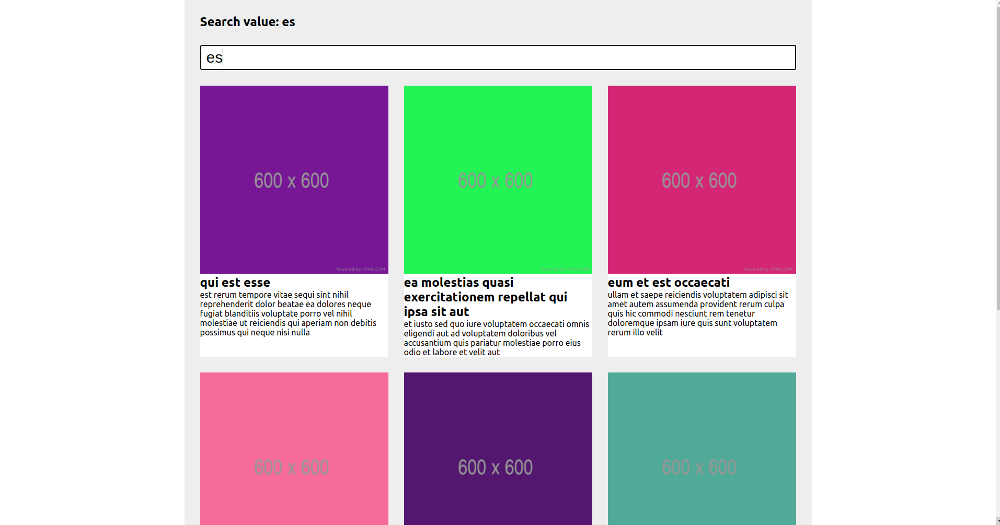
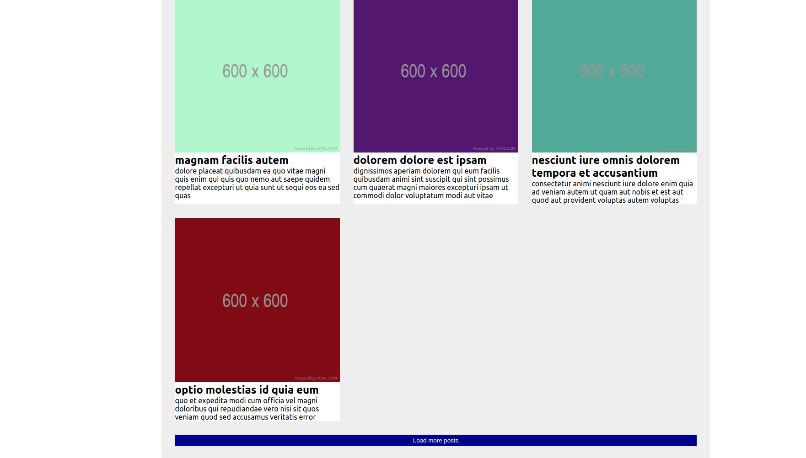

# Post with Search and Load

## Informações do Projeto

**Descrição:**

Este projeto consiste em uma pagina de posts utilizando a API placeholder.json, tem uma component para busca de acordo com os titulos dos posts e também um botão para carregar mais posts por paginas.

**Recursos Utilizados:**

* ReactJs
    * Props e Components
    * Ciclo de vida do Component
    * Consumo de API placheholder
    * Organização de Componentes.
* HTML, CSS

## Resultado

**Post com campo para pesquisa**

**Post com botão para mais carregamento de post na pagina**

**Link do Projeto:**

[Projeto Post with Search and Load](https://post-with-search-and-load.vercel.app/)